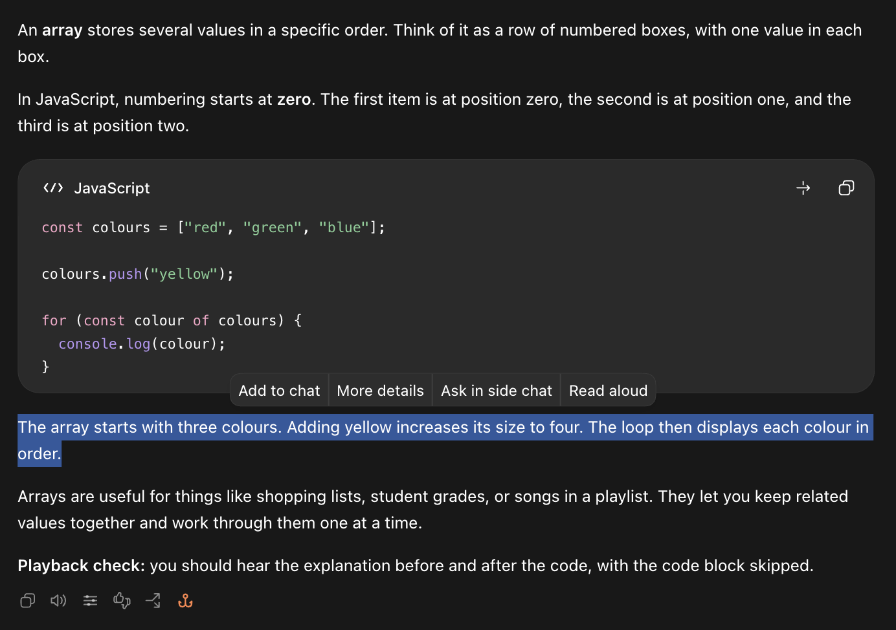

# ChatGPT Read Aloud

A small local read-aloud add-on for **Codex conversations in ChatGPT for Mac**.
For people who find it easier to focus when they can listen and read along.

It adds controls through a separate, locally patched copy of ChatGPT with its
own profile.

## Features

- Read a completed response or **just the text you select**, skipping code blocks.
- Follow a **soft yellow highlight** during Kokoro playback.
- Stop playback or switch to another response.
- Preview and save your choice of **28 English voices**.
- Choose **Use Mac voice** if the local speech helper cannot start.

Speech runs locally with **[Kokoro-82M](https://huggingface.co/hexgrad/Kokoro-82M)**.
**Aoede (`af_aoede`)** is the voice used in our demos; you can choose another.
After setup, speech needs no API key or per-use fees. ChatGPT/Codex response
generation still uses OpenAI.

**Read selected text.** Highlight a passage and choose **Read aloud**.

[See the screenshots](docs/SCREENSHOTS.md).

## Install

**[Give this installation prompt to Codex](docs/INSTALL_WITH_CODEX.md)**
or follow the **[manual setup guide](docs/INSTALLATION.md)**.

Currently supports **ChatGPT 26.928.20755**, **macOS 26+**, and **Apple Silicon**.
New app versions need a compatible rebuild. This is a community add-on installed
as a patched copy; there is no official plugin integration or affiliation with OpenAI.

## Updates

Automatic and manual in-app updates are disabled in the custom copy. Follow the
**[update guide](docs/INSTALLATION.md#updating-an-existing-custom-installation)**
to prepare and verify a compatible build, then quit normally when the installer
is ready. The installer preserves your profile and saved voice, keeps the previous
app for rollback, and checks startup before marking the upgrade complete.
The official ChatGPT app's updates remain independent.

[Behavior details and development notes](docs/DEVELOPMENT.md).

[MIT license](LICENSE) · [Model and dependency credits](THIRD_PARTY.md)
