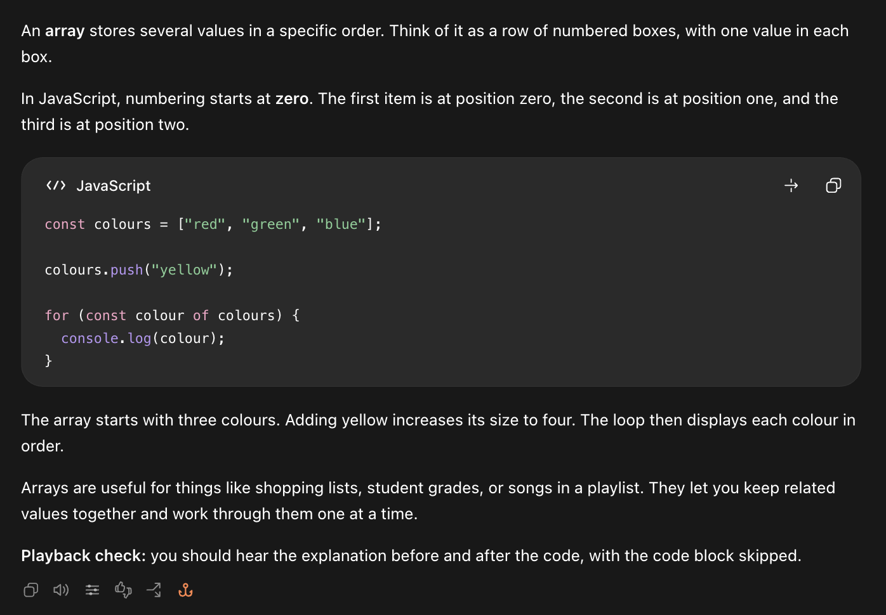
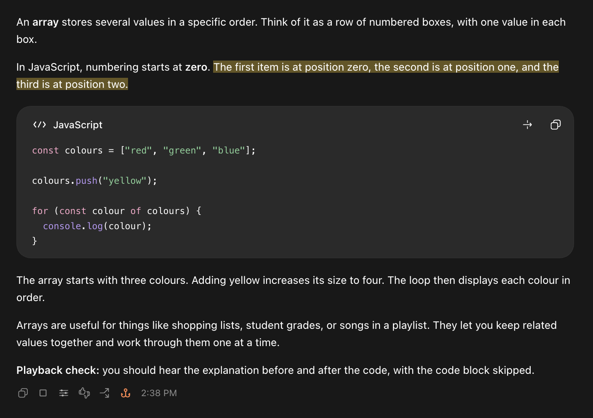
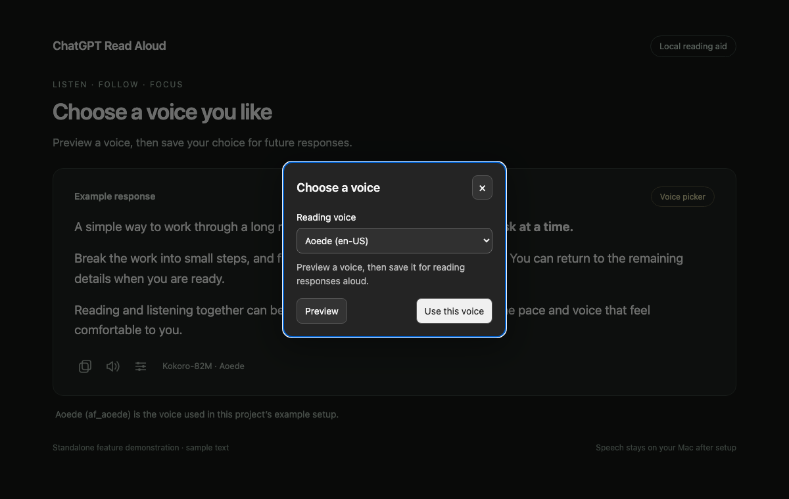

# Screenshots

These captures show ChatGPT Read Aloud in the desktop app, using the arrays
example. They were supplied by the project user on September 30, 2026.

**Read the explanation.** The speaker reads the prose before and after the code
block, skipping the code.

**Read selected text.** Select a passage and choose **Read aloud** to hear only
that part of the response.

**Follow along.** The yellow highlight moves with the sentence being read. The
code block stays visible while speech skips it.

The screenshots are unmodified copies of the supplied images. They show the
controls, selection, and highlight; a static image cannot demonstrate the audio.

## Voice picker demo

**Choose a voice.** Preview and save one of 28 English voices in the installed
add-on. Aoede (`af_aoede`) is the voice used in the original setup.

This voice-picker image is a separate synthetic demonstration with sample
metadata. Its demo controls do not generate speech or save settings.

[Reproduce the synthetic demos](DEVELOPMENT.md#documentation-demos) ·
[Back to the README](../README.md)
